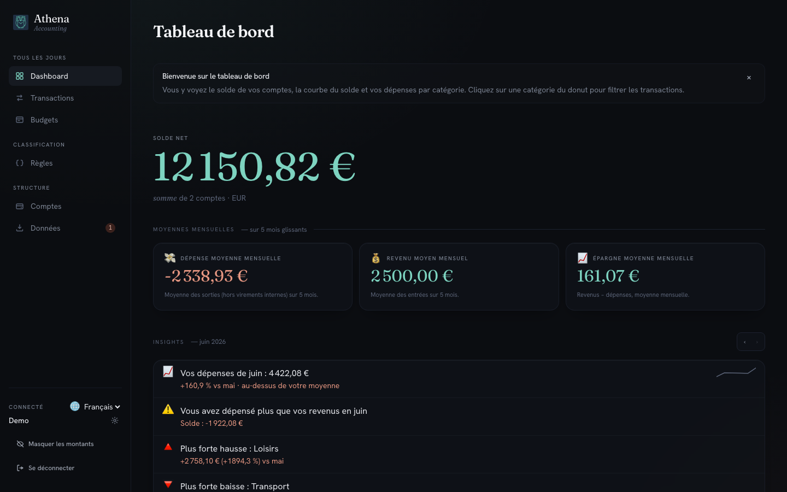

# Démo interactive

Une version d'Athena Accounting tourne directement dans votre navigateur.
Pas de compte, pas d'installation, pas de serveur : tout ce que vous
faites est enregistré uniquement dans `localStorage` (sur votre machine,
dans votre navigateur, isolé du reste du web).

- Le jeu de données par défaut couvre les six derniers mois d'un profil
  fictif francophone (deux comptes, ~180 transactions, budgets,
  catégories, règles).
- Toutes les fonctionnalités qui demandent un vrai serveur —
  l'import de relevés PDF/CSV, les jetons MCP — affichent un message
  « non disponible dans la démo ». Le reste (tri, catégorisation,
  budgets, tableau de bord, Sankey, insights) est pleinement
  utilisable.
- Le bouton **Réinitialiser la démo** en haut de l'écran remet le jeu
  de données d'origine si vous voulez repartir de zéro.

  <a
    href="/Athena-Accounting/demo/"
    className="button button--primary button--lg"
  >
    Ouvrir la démo →
  </a>

## Vous voulez l'installer ?

- [Serveur familial (Docker)](./getting-started) — pour un usage
  multi-utilisateurs sur un NAS, un mini-PC ou une machine dédiée.
- [Application de bureau (macOS/Windows/Linux)](./desktop-install) —
  pour un usage individuel, sans prérequis, en un double-clic.

## Limites de la démo

- Aucun back-end : les endpoints qui reposent sur du code Node
  (parsing PDF, OCR photo, jetons MCP) affichent une modale
  « non disponible ». C'est volontaire — installer Athena localement
  débloque ces fonctionnalités.
- Le stockage est celui du navigateur : effacer les données du site
  supprime aussi la démo. Utilisez-la comme un aperçu, pas comme un
  outil de production.
- Le schéma de la base de démo est versionné ; en cas d'évolution, la
  démo se remet à jour toute seule (les modifications que vous avez
  faites sont alors perdues).
