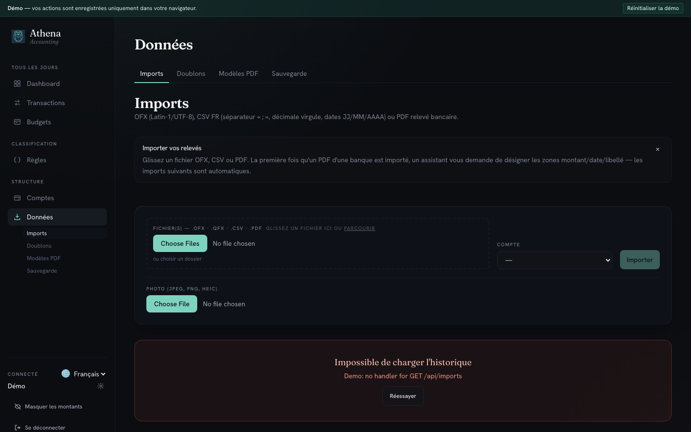
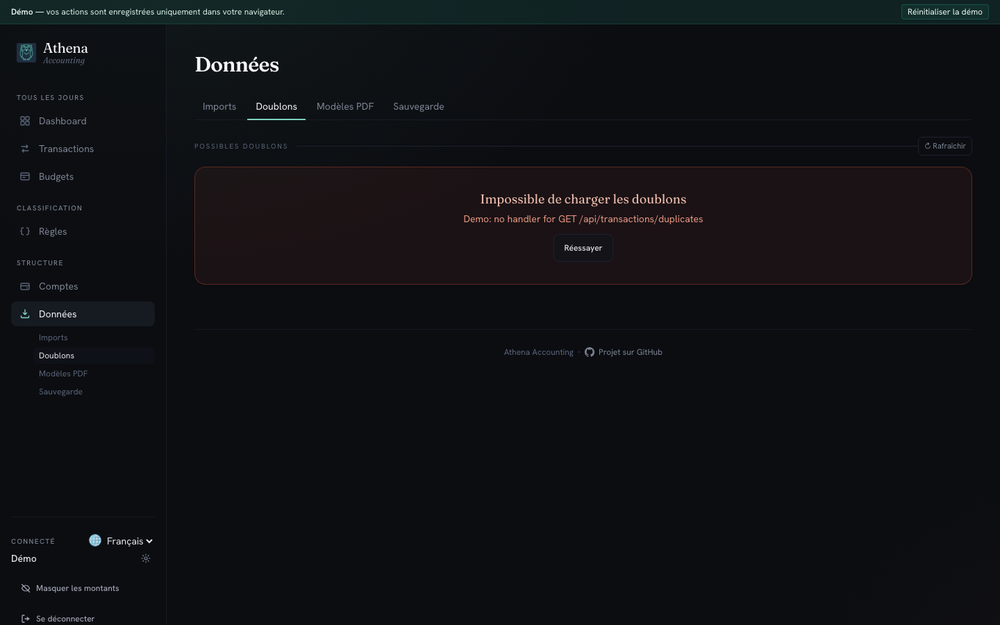
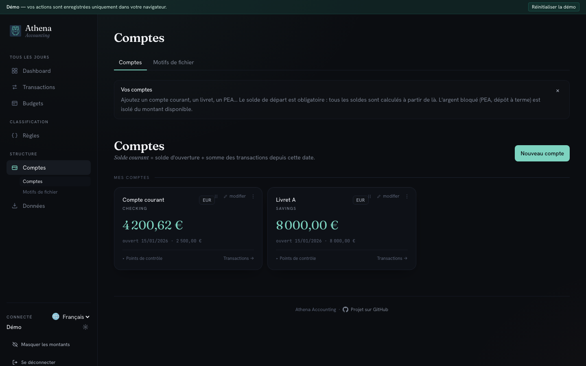

# Importer un relevé bancaire

Athena accepte les fichiers **OFX**, **QFX**, **CSV** (format français) et **PDF** de relevé bancaire. Ce guide vous accompagne du dépôt du fichier jusqu'à la vérification du solde.

## 1. Ouvrir la page Imports

Depuis la barre latérale, dépliez **Données** puis cliquez sur **Imports**. Vous arrivez sur la zone de dépôt : le bandeau du haut rappelle les formats acceptés (OFX Latin‑1/UTF‑8, CSV FR avec séparateur `;` et décimale virgule, dates `JJ/MM/AAAA`, PDF de relevé bancaire).

## 2. Glisser le fichier et choisir le compte

Glissez votre fichier dans la zone **Fichier(s)** — ou cliquez sur **Parcourir**. Sélectionnez le **compte** de destination dans la liste déroulante à droite, puis lancez **Importer**. La première fois qu'un PDF d'une banque est chargé, un assistant s'ouvre : vous désignez à la souris les zones **Date**, **Libellé** et **Montant**. Le modèle est mémorisé — les imports suivants de cette banque sont automatiques.

## 3. Traiter les doublons éventuels

Après l'import, l'onglet **Doublons** liste les transactions candidates : deux lignes très proches en date, montant et libellé. Passez chaque paire en revue et **Fusionner** ou **Ignorer**. Rien n'est écrit sans votre validation.

## 4. Vérifier le solde de contrôle

Rendez-vous sur **Comptes** dans la barre latérale. Chaque compte affiche son solde calculé par Athena à partir des transactions présentes. Comparez-le au solde de clôture indiqué en bas de votre relevé PDF — s'il diffère, c'est le signe qu'une ligne a été zappée à l'import ou qu'un doublon reste à traiter.

## Étapes suivantes

Les transactions importées attendent d'être catégorisées. Continuez avec [Catégoriser les transactions](./categorise-transactions.md) pour créer vos premières règles et automatiser le tri.
