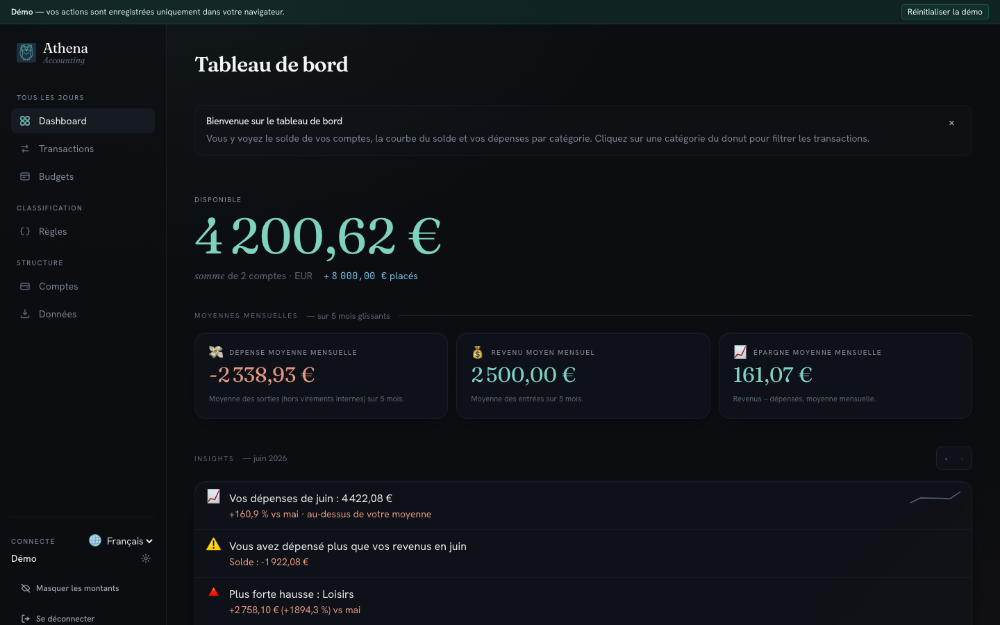
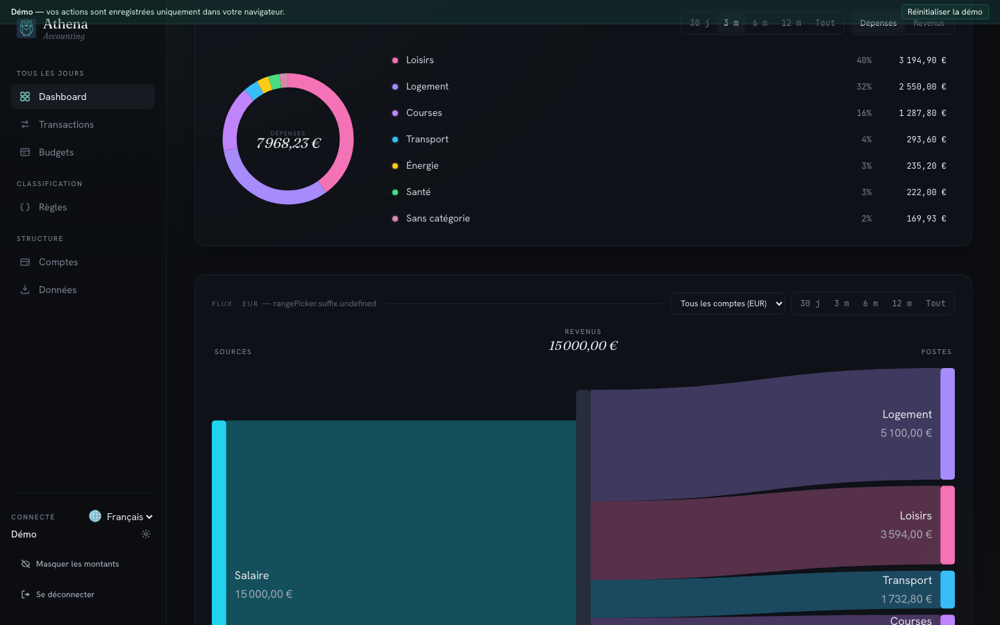
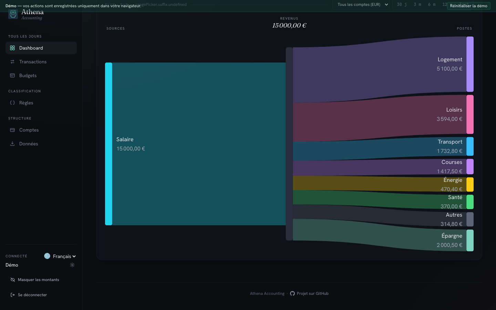

# Consulter les rapports

Le tableau de bord d'Athena tient dans une seule page — trois lectures complémentaires qui répondent à trois questions : « De combien je dispose ? », « Qu'est-ce qui se passe ce mois-ci ? », « Où part l'argent sur la durée ? ».

## 1. Vue d'ensemble et moyennes mensuelles

Ouvrez **Dashboard**. En tête, le solde disponible cumule vos comptes courants ; la ligne juste dessous distingue les fonds **placés** (comptes d'épargne, PEA, etc.) pour éviter de les confondre avec le disponible. Les trois cartes **Moyennes mensuelles** — dépense, revenu, épargne — sont calculées sur les cinq derniers mois glissants pour lisser les creux.

## 2. Insights du mois en cours

Le panneau **Insights** met en lumière les événements marquants du mois : la plus forte hausse par rapport au mois précédent, un dépassement de budget, un revenu inférieur aux dépenses. Chaque insight est une phrase courte cliquable qui vous emmène directement sur les transactions concernées. Les flèches à droite du panneau permettent de naviguer d'un mois à l'autre.

## 3. Vue mensuelle et diagramme Sankey

Continuez à faire défiler pour atteindre la **vue mensuelle** (courbes de solde et de dépenses sur les derniers mois) puis le **Sankey** qui trace, sur la période choisie, le chemin de vos revenus vers vos catégories de dépenses et votre épargne. C'est la lecture qui répond en un coup d'œil à « où part l'argent ? ».

## 4. Filtrer par compte et par période

Les filtres en tête de tableau de bord — sélecteur de compte, plage de dates — s'appliquent instantanément à toutes les cartes, y compris au Sankey et aux Insights. Utile pour isoler un compte joint, ou pour comparer deux trimestres sans changer de page.

## Étapes suivantes

Envie de rejouer l'expérience avec vos propres données ? Repartez de [Importer un relevé bancaire](./import-a-statement.md) pour charger un vrai relevé et voir votre tableau de bord se remplir.
